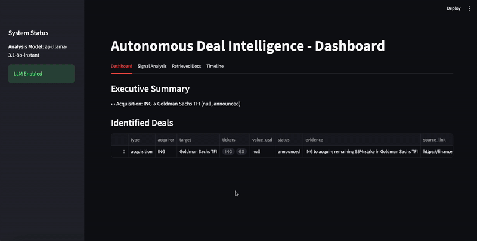

# Autonomous Deal Agent

Autonomous Deal Agent is a small, modular pipeline that continuously (or on-demand) harvests market data and public filings, turns those items into searchable embeddings, runs retrieval + analysis to surface candidate M&A/deal signals, and produces a concise daily (or on-demand) deal intelligence report.

What the system does (end-to-end):

- Ingest: `DataCollector` fetches news headlines and price snapshots per ticker (via `yfinance`) and can optionally pull simplified SEC submission metadata. Ingested items are normalized into serializable LangChain `Document` objects and saved into `state['ingested_docs']` for immediate use by the pipeline.
- Store & Retriever modes: the repo now supports two retrieval modes:
	- BM25 (default): an in-memory BM25 retriever is used which requires no external downloads — great for fast local development and CI. `DataCollector`'s ingested docs are indexed in-memory and used by the `retrieve_step`.
	- FAISS (optional): set `RETRIEVER_MODE=faiss` and provide `INDEX_DIR` to use FAISS with HuggingFace embeddings. This mode persists vectors to disk and supports similarity search across runs but may require a model download the first time.
- Short-term context: writes ephemeral run notes (timestamps, brief notes) to Redis so pipeline modules can keep recent context without polluting the long-term index.
- Analyze: the `retrieve_step` (inserted into the LangGraph flow) populates `state['retrieved_docs']` by selecting top-K documents either from BM25 (using `state['ingested_docs']`) or from FAISS. The `DealAnalyzer` consumes these serialized documents and runs heuristics and optional LLM reasoning to detect "deal-ish" signals (merger/acquisition keywords, filings signals, etc.).
- Report: `ReportGenerator` consolidates findings into structured JSON and a human-readable text summary, and the API exposes endpoints to trigger runs and fetch the latest report.

Key technologies and libraries used:

- Orchestration: LangGraph StateGraph for wiring pipeline steps and managing execution flows. The orchestrator now includes an explicit `retrieve` node.
- Document model: LangChain `Document` objects carry text + normalized metadata.
- Retriever modes:
	- BM25 via `langchain_community.retrievers.BM25Retriever` (default, no heavy downloads).
	- FAISS via `langchain_community.vectorstores.FAISS` with `HuggingFaceEmbeddings` (optional, set `RETRIEVER_MODE=faiss`).
- Embeddings: HuggingFace sentence-transformer models (local) or other OpenAI-compatible embedding providers (configurable).
- Short-term memory: Redis lists for LPUSH/LTRIM/LRANGE-based ephemeral notes (`memory/redis_memory.py`).
- Data sources: `yfinance` for news/prices and public SEC JSON endpoints for filings (`src/data_ingestion/yahoo_sec.py`).
- API/UI: FastAPI (example server) and an optional Streamlit dashboard to preview the latest report.
- Tests: pytest for unit/smoke tests; CI workflow template provided for GitHub Actions.

This repo aims to be practical for local development and CI: BM25 mode allows running the full pipeline without model downloads or FAISS, while FAISS mode enables persistent similarity search in production-style runs. The `retrieve_step` serializes retrieved documents into `state['retrieved_docs']` to keep agent boundaries clean and deterministic for tests.

### Benefits of this architecture
1. Clear separation of concerns (ingest, analysis, reporting). Easier testing and swapping components.
2. Distinct short-term vs long-term memory (Redis vs FAISS) for efficient context handling.
3. First-run & CI-friendly: placeholder FAISS index creation reduces friction.
4. Pluggable model/embedding backends for flexibility and portability.
5. Container-friendly: runs in Docker with Redis as a service for reproducible deployments.

## Repo layout (high level)
- `src/` — main package (now a proper Python package with `__init__.py`)
	- `pipeline/` — core pipeline primitives: `DataCollector`, `DealAnalyzer`, `ReportGenerator` classes
	- `core/` — orchestrator, router, and state shapes (LangGraph wiring)
	- `data_ingestion/` — Yahoo/SEC helpers (`yfinance`, SEC JSON access)
	- `retriever/` — FAISS store helpers and document conversion
	- `memory/` — Redis short-term memory and vector-memory wrapper
	- `ui/` — optional Streamlit preview
- `api/` — example FastAPI server to run the pipeline via HTTP
- `tests/` — pytest tests and fixtures
- `embeddings/` — (ignored) local FAISS index data
- `data/` — outputs and persisted artifacts (e.g., `data/outputs/latest_report.json`)
- `docs/` — supplemental docs, diagrams, and usage examples (optional)
- `scripts/` — helper scripts for local setup, index bootstrapping, and CI utilities (optional)

## Requirements

This project targets Python 3.11 (locally tested). The primary runtime dependencies are in `requirements.txt`. Typical packages used include:

- langgraph, langchain, langchain-community, sentence-transformers, faiss-cpu
- yfinance, requests, pandas
- redis (client)

Use the included `requirements.txt` to install dependencies into a virtualenv.

## Running the Application

### 1. Setup Environment

Create and activate a virtual environment, then install dependencies:

```bash
python -m venv .venv
source .venv/bin/activate
pip install -U pip
pip install -r requirements.txt
```

### 2. Configuration

For local development, create an `env_var` file (ignored by git) based on `env_var.example`:

```bash
cp env_var.example env_var
# Edit env_var with your API keys and preferences
```

### 3. Start Redis (Optional)

If you want to use Redis for short-term memory:

```bash
# macOS (Homebrew)
brew install redis
brew services start redis
```

### 4. Run the API Server

Start the FastAPI server to expose the pipeline endpoints:

```bash
uvicorn api.server:app --host 0.0.0.0 --port 8000 --reload
```

- API Docs: `http://localhost:8000/docs`
- Trigger a run: `POST /run_report`

### 5. Run the UI Dashboard

Start the Streamlit dashboard to visualize the latest report and signals:

```bash
streamlit run src/ui/app.py
```

- Dashboard: `http://localhost:8501`

## Tests

Run pytest from the repo root. The test suite verifies the pipeline components and their interactions.

```bash
source .venv/bin/activate
pytest -q
```

> **Note:** Recent updates have standardized imports to use the `src.` prefix. Ensure you are running tests from the project root.

If tests need FAISS indices or Redis, the test helpers create a small placeholder index automatically so tests can run in CI without prebuilt indexes.

## CI notes (GitHub Actions)

- The repo includes a sample `.github/workflows/ci.yml` that:
	- Runs unit tests in a Linux runner
	- Builds and smoke-tests a Docker image
	- Optionally runs a model/LLM smoke test when a secret (e.g., `GROQ_API_KEY`) is present in repository secrets

- Secrets and large artifacts should not be committed. Use GitHub Secrets to inject API keys and, when necessary, upload/download prebuilt FAISS index artifacts in CI.

## Development tips

- To avoid accidental secret commits, keep `env_var` in `.gitignore` and commit `env_var.example` with placeholders.
- The `src/retriever/store.py` module builds a minimal FAISS index if none exists; this keeps first-run and CI experience smooth.
- For debugging orchestrator flows, set `enable_checkpointer` in the run config to True to enable in-memory checkpointing.

## Contributing

PRs welcome. For changes that affect integrations (e.g., model backends, FAISS layout), include small tests and update this README.

## License & contact

This project is experimental; include license details here if you want to publish.

---

## Architecture & Workflow Diagram

Below is a compact description of the runtime flow and a Mermaid diagram you can paste into a renderer (GitHub README supports Mermaid blocks).

One-line summary: DataCollector -> FAISS (long-term) + Redis (short-term) -> DealAnalyzer -> ReportGenerator -> output

Mermaid diagram:

```mermaid
flowchart LR
	subgraph External
		A[YFinance / Yahoo News] -->|news/prices| Data
		B[SEC JSON / Filings] -->|filings| Data
		C[LLM provider (optional)] -->|generation| Analysis
	end

	Data[DataCollector] -->|Documents / upsert| FAISS[FAISS (embeddings)]
	Data -->|short note| Redis[Redis short-term memory]
	FAISS -->|retrieval| Analysis[DealAnalyzer]
	Analysis -->|findings| Report[ReportGenerator]
	Report -->|report.json + text| Output[data/outputs/latest_report.json]
```

ASCII fallback:

- External sources -> DataCollector
	- DataCollector
		- writes Documents -> FAISS (long-term)
		- writes note -> Redis (short-term)
- FAISS -> DealAnalyzer (retrieves documents) -> ReportGenerator -> output file / API

### Data contract (short)
- Input: `config` object with fields: `tickers: List[str]`, `use_sec: bool`, `top_k: int`, optional `enable_checkpointer: bool`.
- Documents: LangChain `Document` objects with `page_content` and `metadata` containing fields such as `source`, `ticker`/`cik`, `published`, `link`, `is_dealish`.
- Redis short-term notes: JSON objects with `ts` and `note` string stored in a Redis list per module.
- Output: GraphState containing `report` (with `text`, `summary`, and `findings`) and an exported JSON in `data/outputs/latest_report.json`.

Developed by Jasvin Kaur